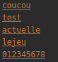
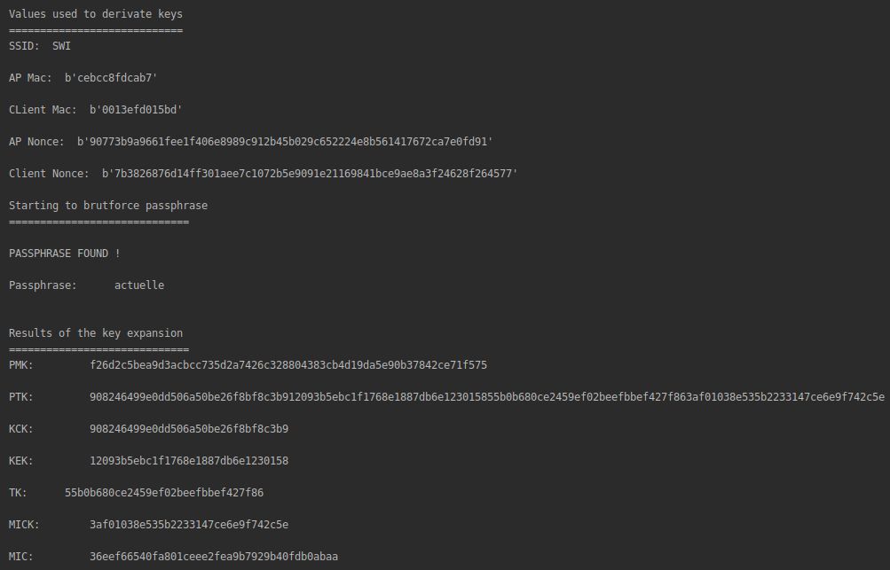
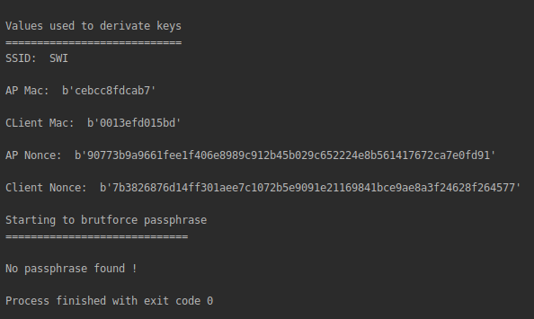
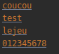

- [Livrables](https://github.com/arubinst/HEIGVD-SWI-Labo3-WPA#livrables)

- [Échéance](https://github.com/arubinst/HEIGVD-SWI-Labo3-WPA#échéance)

- [Travail à réaliser](https://github.com/arubinst/HEIGVD-SWI-Labo3-WPA#travail-à-réaliser)

# Sécurité des réseaux sans fil

## Laboratoire 802.11 Sécurité WPA

### 1. Obtention des paramètres pour la dérivation des clés WPA  

Dans cette première partie, vous allez récupérer le script **Python3** [wpa_key_derivation.py](https://github.com/arubinst/HEIGVD-SWI-Labo3-WPA/blob/master/files/). Il vous faudra également le fichier de capture [wpa_handshake.cap](https://github.com/arubinst/HEIGVD-SWI-Labo3-WPA/blob/master/files/) contenant un processus d’authentification WPA. Vous aurez aussi besoin du fichier [pbkdf2.py](https://github.com/arubinst/HEIGVD-SWI-Labo3-WPA/blob/master/files/), qui permet de calculer les 4096 tours pour le hash de la passphrase. Tous ces fichiers doivent être copiés dans le même répertoire local sur vos machines.

- Ouvrir le fichier de capture [wpa_key_derivation.py](https://github.com/arubinst/HEIGVD-SWI-Labo3-WPA/blob/master/files/) avec Wireshark
- Exécuter le script avec ```python3 wpa_key_derivation.py```
- Essayer d’identifier les valeurs affichées par le script dans la capture Wireshark
- Analyser le fonctionnement du script. En particulier, __faire attention__ à la variable ```data``` qui contient la payload de la trame et la comparer aux données de la quatrième trame du 4-way handshake. Lire [la fin de ce document] pour l’explication de la différence.
- __Modifier le script__ pour qu’il récupère automatiquement, à partir de la capture, les valeurs qui se trouvent actuellement codées en dur (```ssid```, ```APmac```, ```Clientmac```, nonces…) 

---
> Le script se trouve ici : [files/wpa_key_derivation.py](./files/wpa_key_derivation.py).
---

### 2. Scaircrack (aircrack basé sur Scapy)

Aircrack utilise le quatrième message du 4-way handshake pour tester les passphrases contenues dans un dictionnaire. Ce message ne contient pas de données chiffrées mais il est authentifié avec un MIC qui peut être exploité comme « oracle » pour tester des clés différentes obtenues des passphrases du dictionnaire.

Utilisant le script [wpa_key_derivation.py](https://github.com/arubinst/HEIGVD-SWI-Labo3-WPA/blob/master/files/) comme guide, créer un nouveau script scaircrack.py qui doit être capable de :

- Lire une passphrase à partir d’un fichier (wordlist)
- Dériver les clés à partir de la passphrase que vous venez de lire et des autres éléments nécessaires contenus dans la capture (cf [exercice 1](https://github.com/arubinst/HEIGVD-SWI-Labo3-WPA#1-obtention-des-paramètres-pour-la-dérivation-des-clés-wpa))
- Récupérer le MIC du dernier message du 4-way handshake dans la capture
- Avec les clés dérivées à partir de la passphrase, nonces, etc., calculer le MIC du dernier message du 4-way handshake à l’aide de l’algorithme Michael (cf l’explication à la fin de ce document)
- Comparer les deux MIC
   - Identiques &rarr; La passphrase utilisée est correcte
   - Différents &rarr; Essayer avec une nouvelle passphrase

---
> Le script se trouve ici : [files/scaircrack.py](./files/scaircrack.py)
>
> Ci-dessous, nous avons une capture du fichier contenant une liste de mots-de-passe. 
> 
> 
> 
> Sur la capture suivante, nous pouvons voir que nous avons réussi à trouver le mot de passe qui avait été utilisé pour la capture Wireshark. Le script nous affiche la passphrase correcte ainsi que toutes les informations qu'il a réussi à déduire (les différentes clés) avec cette passphrase ainsi qu'avec le SSID, les adresses MAC et les deux nonces.
> 
> 
>
> Si la passphrase ne se trouve pas dans le fichier, le script va simplement nous dire qu'il n'a pas trouvé de passphrase valide.
> 
> 
>
> 
---

## Livrables

Un fork du repo original . Puis, un Pull Request contenant **vos noms** et :

- Script ```wpa_key_derivation.py``` **modifié pour** la récupération automatique des paramètres à partir de la capture. **Les modifications doivent être commentées/documentées**
- Script ```scaircrack.py``` **abondamment commenté/documenté** + fichier wordlist
   - Capture d’écran de votre script en action
-	**(Challenge optionnel)** Script ```scairodump.py``` **abondamment commenté/documenté** 
   - Capture d’écran de votre script en action
-	Envoyer le hash du commit et votre username GitHub et **les noms des participants** par email au professeur et à l'assistant


## Échéance

Le 27 avril 2020 à 23h59
